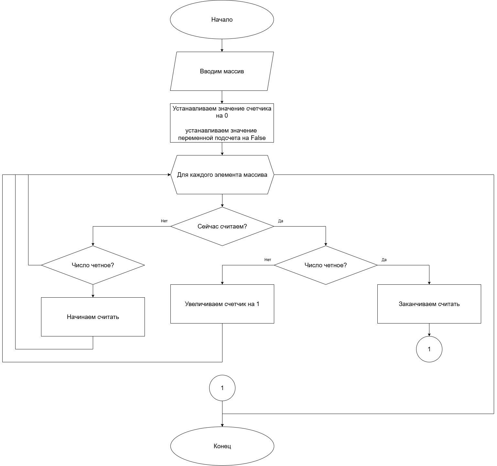
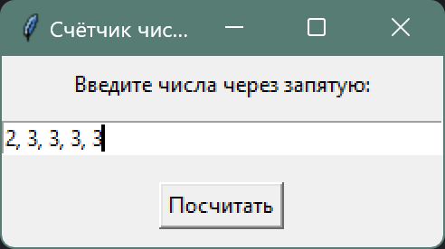

# Практическая работа №14 #      

### Тема: применение основных команд языка программирования ###      

#### Задачи: ####

> Составьте программу для определения количества элементов одномерного массива между первым и последним четными
> элементами (размер массива - произвольный).

#### Системный анализ: ####   

> Входные данные: `array lst`  
> Промежуточные данные: `int counter`, `bool counting`  
> Выходные данные: `int counter`

#### Контрольный пример: ####

> Ввожу [2, 3, 3, 3, 3, 3, 3, 3, 2], получаю 7

##### Блок схема: #####



##### Код программы: #####

```python
import tkinter as tk
from tkinter import messagebox


def count(lst):
    counter = 0
    counting = False

    for i in lst:
        if counting:
            if i % 2 == 0:
                counting = False
                break
            else:
                counter += 1
        else:
            if i % 2 == 0:
                counting = True

    return counter


def calculate():
    try:
        raw = entry.get()
        numbers = [int(x.strip()) for x in raw.split(",")]
        result = count(numbers)
        messagebox.showinfo("Результат", f"Количество: {result}")
    except ValueError:
        messagebox.showerror("Ошибка", "Введите числа через запятую!")


root = tk.Tk()
root.title("Счётчик чисел между чётными")

label = tk.Label(root, text="Введите числа через запятую:")
label.pack(pady=5)

entry = tk.Entry(root, width=40)
entry.pack(pady=5)

button = tk.Button(root, text="Посчитать", command=calculate)
button.pack(pady=10)

root.mainloop()
```

##### Результат работы программы: ######

> Ввожу: 2, 3, 3, 3, 3.  


##### Вывод по проделанной работе: #####    

> Найсик