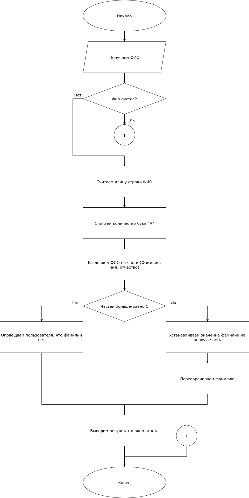
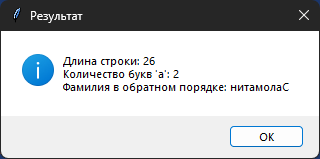
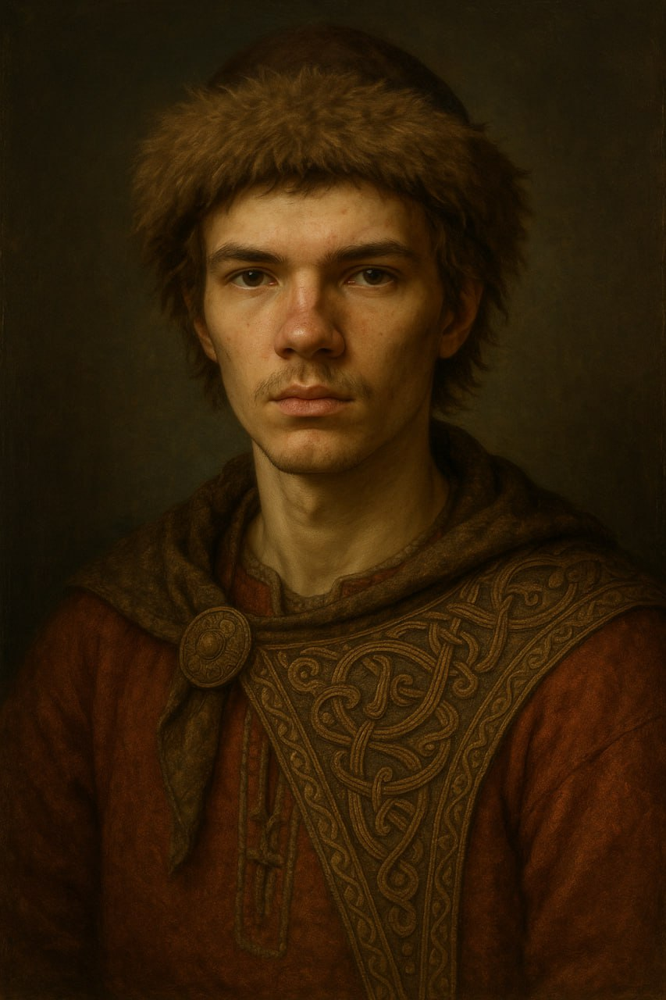

# Практическая работа №15 #      

### Тема: Поиск символьной информации ###    

### Цель: совершенствование навыков составления программ на основе строковой информации ###

#### Задачи: ####

> Введите в Фамилию, Имя, Отчество в виде строковой переменной и определите длину строки и
> количество букв «а». Выполните задание.
> \+ Вариант 14. Вывести фамилию в обратном порядке.

#### Системный анализ: ####   

> Входные данные: `string fio`    
> Промежуточные данные: `int lenght`, `count a`, `list parts`, `string surname`, `string reversed_surname`  
> Выходные данные: `string result`

#### Контрольный пример: ####

> Ввожу "Саломатин Леонид Сергеевич", получаю "Количество А: 2, нитамолаС"

##### Блок схема: #####



##### Код программы: #####

```python
import tkinter as tk
from tkinter import messagebox


def process():
    fio = entry.get().strip()
    if not fio:
        messagebox.showwarning("Ошибка", "Введите ФИО!")
        return

    length = len(fio)

    count_a = fio.lower().count('а')

    parts = fio.split()
    if len(parts) >= 1:
        surname = parts[0]
        reversed_surname = surname[::-1]
    else:
        reversed_surname = "Фамилия не указана"

    result = (
        f"Длина строки: {length}\n"
        f"Количество букв 'а': {count_a}\n"
        f"Фамилия в обратном порядке: {reversed_surname}"
    )
    messagebox.showinfo("Результат", result)


root = tk.Tk()
root.title("Анализ ФИО")
root.geometry("400x200")

label = tk.Label(root, text="Введите Фамилию, Имя, Отчество:")
label.pack(pady=10)

entry = tk.Entry(root, width=40)
entry.pack(pady=5)

button = tk.Button(root, text="Обработать", command=process)
button.pack(pady=10)

root.mainloop()
```

##### Результат работы программы: ######



##### Вывод по проделанной работе: #####    



> Сие дело сотворено во славу учения и разума человеческого. Введено было имя, отчество и прозвище, а программа, яко
> мудрый писец, исчислила длину слова, обрете число букв «а» и показала фамилию вспять обращённую. Труд сей совершён с
> усердием и разумением, и дело завершено благополучно. Да будет похвала труду и знанию!
