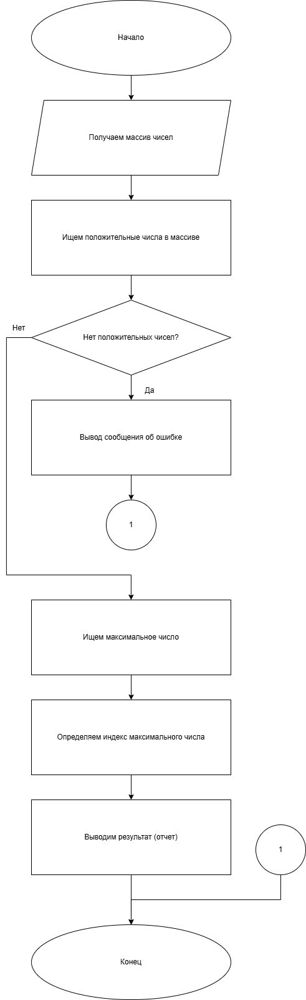
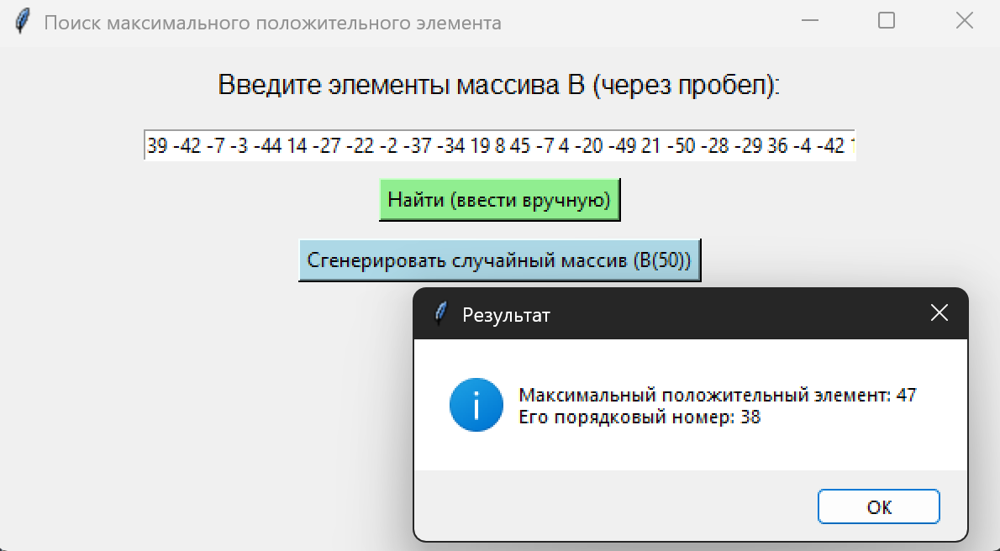

# Практическая работа №16 #      

### Тема: Обработка одномерных массивов ###    

### Цель: совершенствование навыков составления программ на основе одномерных массивов ###

#### Задачи: ####

> Обработать одномерный массив в соответствии с вариантом задания. Массив: B(50) Действия: Определить максимальный
> элемент массива B и вывести его порядковый номер. Условие ограничения: x[i] > 0

#### Системный анализ: ####   

> Входные данные: `list B`  
> Промежуточные данные: `list positive`, `int max_val`, `int index`  
> Выходные данные: `string result_message`

#### Контрольный пример: ####

> Ввожу Массив из чисел, получаю количество максимальный элемент и его индекс

##### Блок схема: #####



##### Код программы: #####

```python
import tkinter as tk
from tkinter import messagebox
import random


def find_max_element(B):
    positive = [x for x in B if x > 0]
    if not positive:
        messagebox.showinfo("Результат", "В массиве нет положительных элементов.")
        return
    max_val = max(positive)
    index = B.index(max_val) + 1  # порядковый номер с 1
    messagebox.showinfo("Результат", f"Максимальный положительный элемент: {max_val}\nЕго порядковый номер: {index}")


def generate_random():
    B = [random.randint(-50, 50) for _ in range(50)]
    entry.delete(0, tk.END)
    entry.insert(0, " ".join(map(str, B)))
    find_max_element(B)


def use_manual_input():
    try:
        B = list(map(int, entry.get().split()))
        if len(B) == 0:
            messagebox.showwarning("Ошибка", "Введите хотя бы одно число!")
            return
        find_max_element(B)
    except ValueError:
        messagebox.showerror("Ошибка", "Введите числа через пробел!")


root = tk.Tk()
root.title("Поиск максимального положительного элемента")
root.geometry("600x300")

label = tk.Label(root, text="Введите элементы массива B (через пробел):", font=("Arial", 12))
label.pack(pady=10)

entry = tk.Entry(root, width=70)
entry.pack(pady=5)

btn_manual = tk.Button(root, text="Найти (ввести вручную)", command=use_manual_input, bg="#90ee90")
btn_manual.pack(pady=5)

btn_random = tk.Button(root, text="Сгенерировать случайный массив (B(50))", command=generate_random, bg="#add8e6")
btn_random.pack(pady=5)

root.mainloop()

```

##### Результат работы программы: ######



##### Вывод по проделанной работе: #####    


> Я делать работа. Программа брать много число, делать массив. Потом искать самый большой число, который хороший — не
> минус. Если нет хороший число — программа говорить «нет». Если есть — говорить какой большой и где стоит. Я рад,
> программа работать, не ломаться. Я теперь понимать чуть-чуть, как делать массив. Хорошо, да.