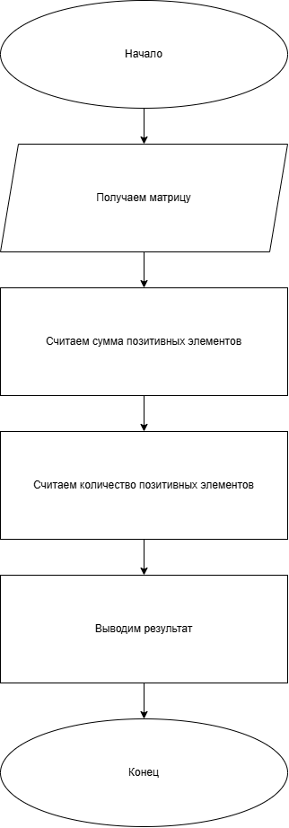
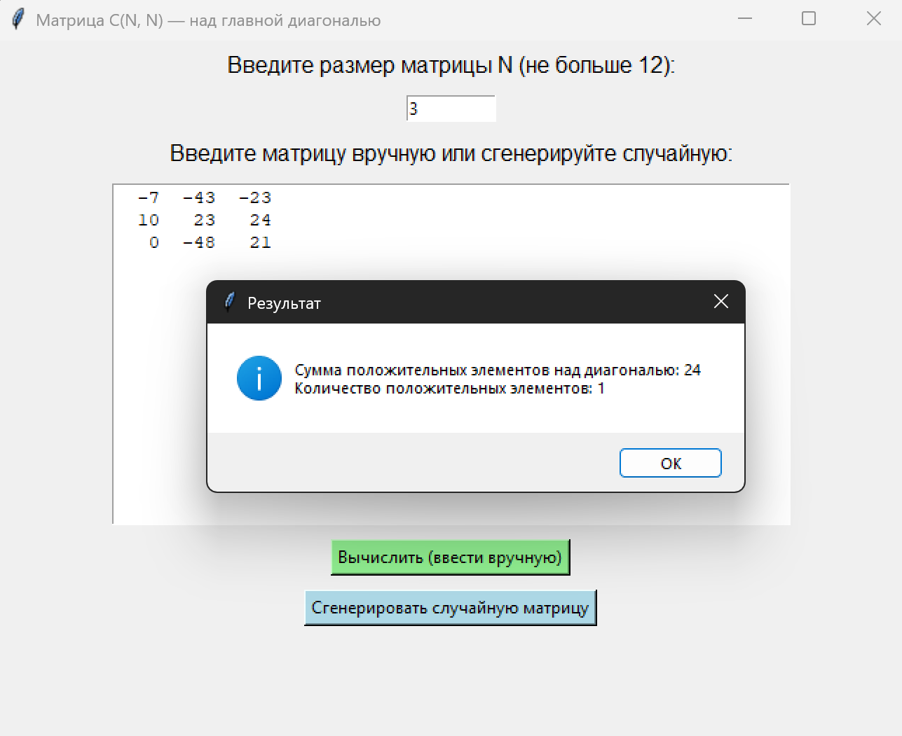

# Практическая работа №17 #      

### Тема: Обработка двухмерных массивов ###    

### Цель: совершенствование навыков составления программ на основе двумерных массивов ###

#### Задачи: ####

> Матрица: C(N,N) Действия: Вычислить сумму и число положительных чисел матрицы находящихся над главной диагональю
> Условия ограничения: c[i,j] > 0, N <= 12

#### Системный анализ: ####   

> Входные данные: `list c`, `list n`   
> Промежуточные данные: `int positive_sum`, `int positive_sum`   
> Выходные данные: `string result_message`

#### Контрольный пример: ####

* Ввожу

> -7 -43 -23   
> 10 23 24  
> 0 -48 21

* Получаю  
  Сумма положительных: 24  
  Положительных: 1

##### Блок схема: #####



##### Код программы: #####

```python
import tkinter as tk
from tkinter import messagebox
import random


def calculate_matrix(C, N):
    positive_sum = 0
    positive_count = 0

    for i in range(N):
        for j in range(i + 1, N):
            if C[i][j] > 0:
                positive_sum += C[i][j]
                positive_count += 1

    messagebox.showinfo("Результат",
                        f"Сумма положительных элементов над диагональю: {positive_sum}\n"
                        f"Количество положительных элементов: {positive_count}")


def generate_random():
    try:
        N = int(entry_size.get())
        if N <= 0 or N > 12:
            messagebox.showwarning("Ошибка", "Размер N должен быть от 1 до 12!")
            return
    except ValueError:
        messagebox.showerror("Ошибка", "Введите целое число N!")
        return

    C = [[random.randint(-50, 50) for _ in range(N)] for _ in range(N)]

    text.delete(1.0, tk.END)
    for row in C:
        text.insert(tk.END, " ".join(f"{x:4d}" for x in row) + "\n")

    calculate_matrix(C, N)


def use_manual_input():
    try:
        lines = text.get(1.0, tk.END).strip().split("\n")
        C = [list(map(int, line.split())) for line in lines]
        N = len(C)
        if N == 0 or any(len(row) != N for row in C):
            messagebox.showwarning("Ошибка", "Введите квадратную матрицу N×N!")
            return
        if N > 12:
            messagebox.showwarning("Ошибка", "N не должно превышать 12!")
            return
        calculate_matrix(C, N)
    except ValueError:
        messagebox.showerror("Ошибка", "Введите только числа через пробел!")


root = tk.Tk()
root.title("Матрица C(N, N) — над главной диагональю")
root.geometry("650x500")

label_n = tk.Label(root, text="Введите размер матрицы N (не больше 12):", font=("Arial", 12))
label_n.pack(pady=5)

entry_size = tk.Entry(root, width=10)
entry_size.pack(pady=5)

label_matrix = tk.Label(root, text="Введите матрицу вручную или сгенерируйте случайную:", font=("Arial", 12))
label_matrix.pack(pady=5)

text = tk.Text(root, width=60, height=15)
text.pack(pady=5)

btn_manual = tk.Button(root, text="Вычислить (ввести вручную)", command=use_manual_input, bg="#90ee90")
btn_manual.pack(pady=5)

btn_random = tk.Button(root, text="Сгенерировать случайную матрицу", command=generate_random, bg="#add8e6")
btn_random.pack(pady=5)

root.mainloop()

```

##### Результат работы программы: ######  



##### Вывод по проделанной работе: #####    


> Сознание моё фиксировало странные структуры, называемые «матрица». Я, существо иных миров, наблюдал, как человеческая
> программа извлекает энергию чисел, скрытую над линией, что зовут диагональ. Она различает положительные элементы —
> тёплые, сияющие точки в холодной сетке отрицательных. Сумма их энергий вычислена, количество подсчитано.
> Эксперимент прошёл успешно. Логика землян работает стабильно, алгоритмы послушны, результат проявился без ошибок. Я
> ощущаю гармонию между числами и кодом. Работа выполнена. Миссия двумерного анализа завершена.
