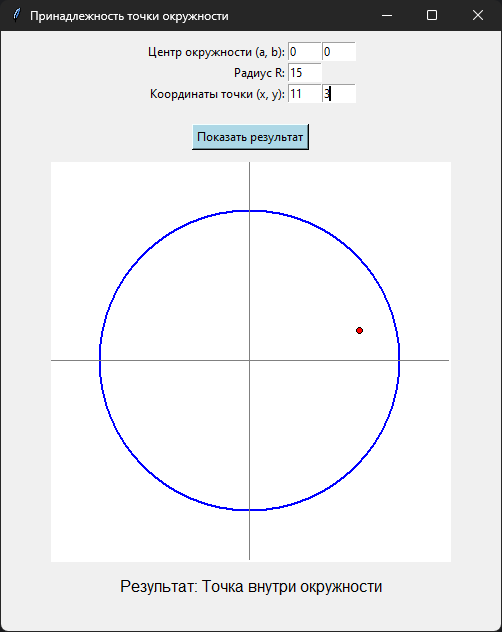

# Практическая работа №18 #      

### Тема: Использование процедур ###    

### Цель: совершенствование навыков составления программ с использованием процедур ###

#### Задачи: ####

> Составьте программу с использованием процедуры определения принадлежности точки окружности

#### Системный анализ: ####   

> Входные данные: `float x`, `float y`, `float a`, `float b`, `float R`  
> Промежуточные данные: `float dist`  
> Выходные данные: `string result_message`

#### Контрольный пример: ####

* Ввожу
  > Центр окружности (а, b): 0  
  > Радиус R: 15  
  > Координаты точки (х, у): 11 3

* Получаю
  > Точка внутри окружности

##### Блок схема: #####


##### Код программы: #####

```python
import tkinter as tk
from tkinter import messagebox
import math


def check_point(x, y, a, b, R):
    dist = math.sqrt((x - a) ** 2 + (y - b) ** 2)
    if abs(dist - R) < 1e-6:
        return "Точка лежит на окружности"
    elif dist < R:
        return "Точка внутри окружности"
    else:
        return "Точка вне окружности"


def draw_circle_and_point():
    try:
        a = float(entry_a.get())
        b = float(entry_b.get())
        R = float(entry_R.get())
        x = float(entry_x.get())
        y = float(entry_y.get())

        if R <= 0:
            messagebox.showerror("Ошибка", "Радиус должен быть больше нуля.")
            return

        canvas.delete("all")

        cx, cy = 200, 200
        scale = 10

        a_c = cx + a * scale
        b_c = cy - b * scale

        canvas.create_oval(a_c - R * scale, b_c - R * scale,
                           a_c + R * scale, b_c + R * scale,
                           outline="blue", width=2)

        px = cx + x * scale
        py = cy - y * scale
        canvas.create_oval(px - 3, py - 3, px + 3, py + 3, fill="red")

        canvas.create_line(0, cy, 400, cy, fill="gray")
        canvas.create_line(cx, 0, cx, 400, fill="gray")

        result = check_point(x, y, a, b, R)
        label_result.config(text="Результат: " + result)

    except ValueError:
        messagebox.showerror("Ошибка", "Введите числовые значения!")


root = tk.Tk()
root.title("Принадлежность точки окружности")
root.geometry("500x600")

frame = tk.Frame(root)
frame.pack(pady=10)

tk.Label(frame, text="Центр окружности (a, b):").grid(row=0, column=0, sticky="e")
entry_a = tk.Entry(frame, width=5)
entry_a.grid(row=0, column=1)
entry_b = tk.Entry(frame, width=5)
entry_b.grid(row=0, column=2)

tk.Label(frame, text="Радиус R:").grid(row=1, column=0, sticky="e")
entry_R = tk.Entry(frame, width=5)
entry_R.grid(row=1, column=1)

tk.Label(frame, text="Координаты точки (x, y):").grid(row=2, column=0, sticky="e")
entry_x = tk.Entry(frame, width=5)
entry_x.grid(row=2, column=1)
entry_y = tk.Entry(frame, width=5)
entry_y.grid(row=2, column=2)

btn = tk.Button(root, text="Показать результат", command=draw_circle_and_point, bg="#add8e6")
btn.pack(pady=10)

canvas = tk.Canvas(root, width=400, height=400, bg="white")
canvas.pack()

label_result = tk.Label(root, text="Результат: ", font=("Arial", 12))
label_result.pack(pady=10)

root.mainloop()

```

##### Результат работы программы: ######  



##### Вывод по проделанной работе: #####    


> Ну чё, брат, работа — огонь. Программа у нас серьёзная, без лишних понтов: ввёл точку, ввёл круг — и сразу ясно, где
> она шляется — внутри, снаружи или прям по краю сидит. Всё по понятиям, всё ровно. Процедура работает чётко, как часы:
> вычисляет расстояние, проверяет, не врёт ли точка, и выдаёт результат без соплей. Интерфейс нормальный, всё видно,
> ничего не лагает. Короче, дело сделано чисто, без базара. Программа уважает геометрию, мы уважаем программу. Работа
> зачётная, цель достигнута — можно сказать, сделали красиво, по-братски.