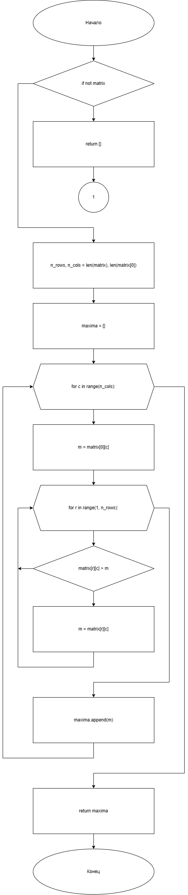
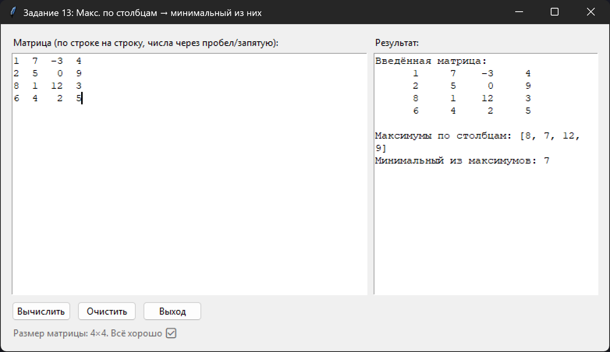

# Практическая работа №20

### Тема: Работа с двумерными массивами

### Цель: совершенствование навыков составления программ на основе двумерных массивов

#### Задачи:

> Составьте программу, которая бы находила наибольшие элементы столбцов, а затем из них определяла наименьший элемент

#### Системный анализ:

> Входные данные: `list matrix`  
> Промежуточные данные: `int n_rows` `int n_cols` `list m`  
> Выходные данные: `int maxima`

#### Контрольный пример:

- Ввожу
    > 1  7  -3  4  
    > 2  5   0  9  
    > 8  1  12  3  
    > 6  4   2  5  

- Получаю

    > Введённая матрица:  
    >      1     7    -3     4  
    >      2     5     0     9  
    >      8     1    12     3  
    >      6     4     2     5  
    >
    > Максимумы по столбцам: [8, 7, 12, 9]  
    > Минимальный из максимумов: 7

#### Блок схема:



#### Код программы:

```python
import tkinter as tk
from tkinter import ttk, messagebox


def remove_odd_between_min_max(arr):
    if not arr:
        return arr

    min_index = arr.index(min(arr))
    max_index = arr.index(max(arr))

    if min_index > max_index:
        min_index, max_index = max_index, min_index

    result = (
        arr[:min_index + 1] +
        [x for x in arr[min_index + 1:max_index] if x % 2 == 0] +
        arr[max_index:]
    )
    return result


def parse_input(text: str):
    if not text.strip():
        return []
    parts = text.replace(",", " ").split()
    return [int(p) for p in parts]


class App(tk.Tk):
    def __init__(self):
        super().__init__()
        self.title("Удаление нечётных между min и max — tkinter")
        self.geometry("700x260")
        self.minsize(640, 220)

        container = ttk.Frame(self, padding=16)
        container.pack(fill="both", expand=True)

        title = ttk.Label(
            container,
            text="Удалить нечётные элементы между минимальным и максимальным (не включительно)",
            font=("Segoe UI", 12, "bold"),
            wraplength=650,
            justify="left",
        )
        title.grid(row=0, column=0, columnspan=3, sticky="w", pady=(0, 8))

        ttk.Label(container, text="Массив (числа через пробел/запятую):").grid(row=1, column=0, sticky="w")
        self.entry = ttk.Entry(container)
        self.entry.grid(row=1, column=1, columnspan=2, sticky="ew", padx=(8, 0))
        self.entry.insert(0, "7 3 5 2 9 4 8 1")

        btn_frame = ttk.Frame(container)
        btn_frame.grid(row=2, column=0, columnspan=3, sticky="w", pady=(10, 0))
        self.btn_process = ttk.Button(btn_frame, text="Обработать", command=self.on_process)
        self.btn_process.pack(side="left")
        ttk.Button(btn_frame, text="Очистить", command=self.on_clear).pack(side="left", padx=(8, 0))
        ttk.Button(btn_frame, text="Выход", command=self.destroy).pack(side="left", padx=(8, 0))

        ttk.Label(container, text="Результат:").grid(row=3, column=0, sticky="nw", pady=(14, 0))
        self.result_box = tk.Text(container, height=4, width=60, wrap="word")
        self.result_box.grid(row=3, column=1, columnspan=2, sticky="nsew", padx=(8, 0), pady=(10, 0))
        self.result_box.configure(state="disabled")

        self.status = ttk.Label(container, text="", foreground="#666")
        self.status.grid(row=4, column=0, columnspan=3, sticky="w", pady=(8, 0))

        container.columnconfigure(1, weight=1)
        container.columnconfigure(2, weight=0)
        container.rowconfigure(3, weight=1)

        self.entry.bind("<Return>", lambda e: self.on_process())

        try:
            self.tk.call("tk", "scaling", 1.25)
        except Exception:
            pass

    def on_process(self):
        text = self.entry.get()
        try:
            arr = parse_input(text)
        except ValueError:
            messagebox.showerror("Ошибка ввода", "Введите только целые числа, разделённые пробелами или запятыми.")
            return

        result = remove_odd_between_min_max(arr)

        self._set_result(f"Исходный массив: {arr}\nРезультат:       {result}")
        self.status.configure(
            text="Подсказка: если минимальный правее максимального, они автоматически меняются местами. "
                 "При нескольких одинаковых min/max берётся первый с начала."
        )

    def on_clear(self):
        self.entry.delete(0, tk.END)
        self._set_result("")
        self.status.configure(text="")

    def _set_result(self, text):
        self.result_box.configure(state="normal")
        self.result_box.delete("1.0", tk.END)
        self.result_box.insert("1.0", text)
        self.result_box.configure(state="disabled")


def main():
    app = App()
    app.mainloop()


if __name__ == "__main__":
    main()

```

#### Результат работы программы:



#### Вывод по проделанной работе:

> Нормально
