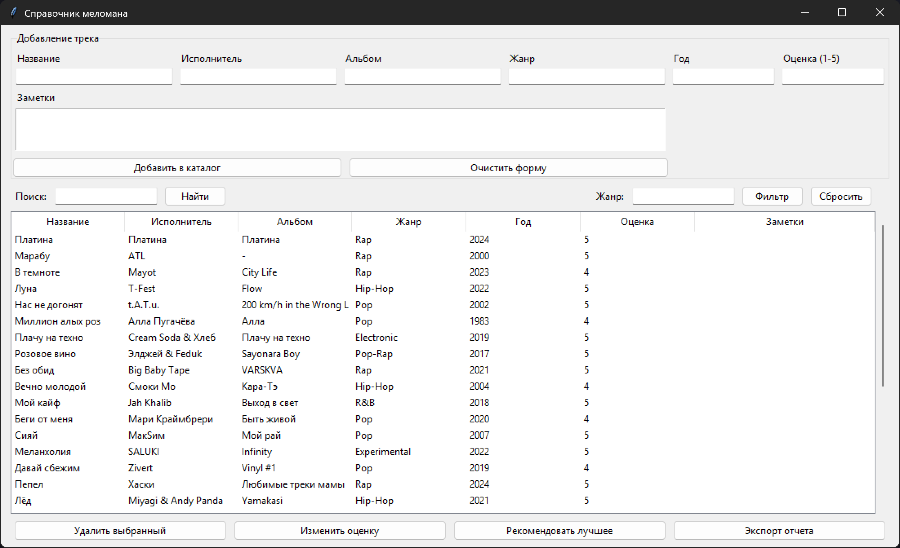

# Практическая работа №21

### Тема: Использование планировщика задач

### Цель: совершенствование навыков составления программ на основе планировщика задач

#### Задачи:

> Составьте справочник меломана

#### Код программы:

```python
from __future__ import annotations

import json
from dataclasses import dataclass, asdict
from pathlib import Path
from typing import Dict, List, Optional

import tkinter as tk
from tkinter import ttk, messagebox, simpledialog


CATALOG_FILE = Path(__file__).with_name("melomaniac_catalog.json")


@dataclass
class Track:
    track_id: int
    title: str
    artist: str
    album: str
    genre: str
    year: Optional[int]
    rating: Optional[int]
    notes: str


def load_catalog() -> List[Track]:
    if not CATALOG_FILE.exists():
        return []

    try:
        with CATALOG_FILE.open("r", encoding="utf-8") as file:
            raw_tracks = json.load(file)
    except (json.JSONDecodeError, OSError):
        return []

    tracks: List[Track] = []
    for entry in raw_tracks:
        try:
            tracks.append(
                Track(
                    track_id=int(entry["track_id"]),
                    title=str(entry["title"]),
                    artist=str(entry["artist"]),
                    album=str(entry.get("album", "")),
                    genre=str(entry.get("genre", "")),
                    year=int(entry["year"]) if entry.get("year") else None,
                    rating=int(entry["rating"]) if entry.get("rating") else None,
                    notes=str(entry.get("notes", "")),
                )
            )
        except (KeyError, ValueError, TypeError):
            continue
    return tracks


def save_catalog(catalog: List[Track]) -> None:
    serialized = [asdict(track) for track in catalog]
    with CATALOG_FILE.open("w", encoding="utf-8") as file:
        json.dump(serialized, file, ensure_ascii=False, indent=2)


def next_track_id(catalog: List[Track]) -> int:
    return max((track.track_id for track in catalog), default=0) + 1


class MelomaniacApp(tk.Tk):
    def __init__(self) -> None:
        super().__init__()
        self.title("Справочник меломана")
        self.geometry("1100x640")
        self.minsize(900, 550)

        self.catalog: List[Track] = load_catalog()
        self.current_view: List[Track] = list(self.catalog)
        self.entries: Dict[str, tk.Entry] = {}
        self.notes_text: tk.Text
        self.tree: ttk.Treeview
        self.search_var = tk.StringVar()
        self.genre_var = tk.StringVar()

        self._build_layout()
        self.refresh_tree()

    def _build_layout(self) -> None:
        self.columnconfigure(0, weight=1)
        self.rowconfigure(1, weight=1)

        self._build_form_section()
        self._build_list_section()
        self._build_action_section()

    def _build_form_section(self) -> None:
        form_frame = ttk.LabelFrame(self, text="Добавление трека")
        form_frame.grid(row=0, column=0, sticky="ew", padx=12, pady=8)
        form_frame.columnconfigure((0, 1, 2, 3), weight=1, uniform="cols")

        fields = [
            ("title", "Название"),
            ("artist", "Исполнитель"),
            ("album", "Альбом"),
            ("genre", "Жанр"),
            ("year", "Год"),
            ("rating", "Оценка (1-5)"),
        ]

        for idx, (key, label) in enumerate(fields):
            ttk.Label(form_frame, text=label).grid(row=0, column=idx, sticky="w", padx=4, pady=(6, 2))
            entry = ttk.Entry(form_frame)
            entry.grid(row=1, column=idx, sticky="ew", padx=4, pady=(0, 6))
            self.entries[key] = entry

        ttk.Label(form_frame, text="Заметки").grid(row=2, column=0, sticky="w", padx=4)
        self.notes_text = tk.Text(form_frame, height=3, wrap="word")
        self.notes_text.grid(row=3, column=0, columnspan=4, sticky="ew", padx=4, pady=4)

        buttons_frame = ttk.Frame(form_frame)
        buttons_frame.grid(row=4, column=0, columnspan=4, sticky="ew", pady=(4, 0))
        buttons_frame.columnconfigure(0, weight=1)
        buttons_frame.columnconfigure(1, weight=1)

        ttk.Button(buttons_frame, text="Добавить в каталог", command=self.add_track).grid(
            row=0, column=0, sticky="ew", padx=(0, 4)
        )
        ttk.Button(buttons_frame, text="Очистить форму", command=self.reset_form).grid(
            row=0, column=1, sticky="ew", padx=(4, 0)
        )

    def _build_list_section(self) -> None:
        list_frame = ttk.Frame(self)
        list_frame.grid(row=1, column=0, sticky="nsew", padx=12)
        list_frame.rowconfigure(1, weight=1)
        list_frame.columnconfigure(0, weight=1)

        filter_frame = ttk.Frame(list_frame)
        filter_frame.grid(row=0, column=0, sticky="ew", pady=(0, 6))
        filter_frame.columnconfigure(3, weight=1)

        ttk.Label(filter_frame, text="Поиск:").grid(row=0, column=0, sticky="w", padx=4)
        search_entry = ttk.Entry(filter_frame, textvariable=self.search_var)
        search_entry.grid(row=0, column=1, sticky="ew", padx=4)
        ttk.Button(filter_frame, text="Найти", command=self.search_tracks).grid(row=0, column=2, padx=4)

        ttk.Label(filter_frame, text="Жанр:").grid(row=0, column=3, sticky="e", padx=4)
        genre_entry = ttk.Entry(filter_frame, textvariable=self.genre_var)
        genre_entry.grid(row=0, column=4, sticky="ew", padx=4)
        ttk.Button(filter_frame, text="Фильтр", command=self.filter_by_genre).grid(row=0, column=5, padx=4)
        ttk.Button(filter_frame, text="Сбросить", command=self.reset_filters).grid(row=0, column=6, padx=4)

        columns = ("title", "artist", "album", "genre", "year", "rating", "notes")
        self.tree = ttk.Treeview(list_frame, columns=columns, show="headings", selectmode="browse")
        for col, heading in zip(
            columns,
            ["Название", "Исполнитель", "Альбом", "Жанр", "Год", "Оценка", "Заметки"],
        ):
            self.tree.heading(col, text=heading)
            self.tree.column(col, width=120, anchor="w")
        self.tree.column("notes", width=200)

        scrollbar = ttk.Scrollbar(list_frame, orient="vertical", command=self.tree.yview)
        self.tree.configure(yscrollcommand=scrollbar.set)
        self.tree.grid(row=1, column=0, sticky="nsew")
        scrollbar.grid(row=1, column=1, sticky="ns")

    def _build_action_section(self) -> None:
        actions_frame = ttk.Frame(self)
        actions_frame.grid(row=2, column=0, sticky="ew", padx=12, pady=8)
        actions_frame.columnconfigure((0, 1, 2, 3), weight=1, uniform="act")

        ttk.Button(actions_frame, text="Удалить выбранный", command=self.delete_track).grid(
            row=0, column=0, sticky="ew", padx=4
        )
        ttk.Button(actions_frame, text="Изменить оценку", command=self.update_rating).grid(
            row=0, column=1, sticky="ew", padx=4
        )
        ttk.Button(actions_frame, text="Рекомендовать лучшее", command=self.show_recommendations).grid(
            row=0, column=2, sticky="ew", padx=4
        )
        ttk.Button(actions_frame, text="Экспорт отчета", command=self.export_summary).grid(
            row=0, column=3, sticky="ew", padx=4
        )

    def refresh_tree(self, data: Optional[List[Track]] = None) -> None:
        dataset = data if data is not None else self.current_view
        self.tree.delete(*self.tree.get_children())
        for track in dataset:
            values = (
                track.title,
                track.artist,
                track.album,
                track.genre,
                track.year or "",
                track.rating or "",
                track.notes,
            )
            self.tree.insert("", "end", iid=str(track.track_id), values=values)

    def add_track(self) -> None:
        track = self._build_track_from_form()
        if not track:
            return
        self.catalog.append(track)
        save_catalog(self.catalog)
        self.reset_filters()
        self.reset_form()
        messagebox.showinfo("Готово", f"Трек «{track.title}» добавлен.")

    def _build_track_from_form(self) -> Optional[Track]:
        title = self.entries["title"].get().strip()
        artist = self.entries["artist"].get().strip()
        album = self.entries["album"].get().strip()
        genre = self.entries["genre"].get().strip()
        year_raw = self.entries["year"].get().strip()
        rating_raw = self.entries["rating"].get().strip()
        notes = self.notes_text.get("1.0", "end").strip()

        if not title or not artist:
            messagebox.showwarning("Ошибка", "Название и исполнитель обязательны.")
            return None

        try:
            year = int(year_raw) if year_raw else None
        except ValueError:
            messagebox.showwarning("Ошибка", "Год должен быть числом.")
            return None

        try:
            rating = int(rating_raw) if rating_raw else None
            if rating is not None and not (1 <= rating <= 5):
                raise ValueError
        except ValueError:
            messagebox.showwarning("Ошибка", "Оценка должна быть числом от 1 до 5.")
            return None

        return Track(
            track_id=next_track_id(self.catalog),
            title=title,
            artist=artist,
            album=album,
            genre=genre,
            year=year,
            rating=rating,
            notes=notes,
        )

    def reset_form(self) -> None:
        for entry in self.entries.values():
            entry.delete(0, "end")
        self.notes_text.delete("1.0", "end")

    def delete_track(self) -> None:
        selection = self.tree.selection()
        if not selection:
            messagebox.showinfo("Нет выбора", "Сначала выберите трек в списке.")
            return
        track_id = int(selection[0])
        track = next((t for t in self.catalog if t.track_id == track_id), None)
        if not track:
            messagebox.showwarning("Ошибка", "Не удалось найти трек в каталоге.")
            return
        if not messagebox.askyesno("Подтверждение", f"Удалить «{track.title}»?"):
            return
        self.catalog.remove(track)
        save_catalog(self.catalog)
        self.reset_filters()
        messagebox.showinfo("Готово", "Трек удален.")

    def update_rating(self) -> None:
        selection = self.tree.selection()
        if not selection:
            messagebox.showinfo("Нет выбора", "Сначала выберите трек.")
            return
        track_id = int(selection[0])
        track = next((t for t in self.catalog if t.track_id == track_id), None)
        if not track:
            messagebox.showwarning("Ошибка", "Не удалось найти трек.")
            return

        new_rating = simpledialog.askinteger(
            "Новая оценка",
            "Введите оценку 1-5 (0 — очистить):",
            parent=self,
            minvalue=0,
            maxvalue=5,
        )
        if new_rating is None:
            return

        track.rating = None if new_rating == 0 else new_rating
        save_catalog(self.catalog)
        self.refresh_tree()
        messagebox.showinfo("Готово", "Оценка обновлена.")

    def search_tracks(self) -> None:
        query = self.search_var.get().strip().lower()
        if not query:
            messagebox.showinfo("Поиск", "Введите ключевое слово.")
            return
        results = [
            track
            for track in self.catalog
            if query in track.title.lower()
            or query in track.artist.lower()
            or query in track.album.lower()
            or query in track.genre.lower()
        ]
        self.current_view = results
        self.refresh_tree()
        messagebox.showinfo("Поиск", f"Найдено {len(results)} трек(ов).")

    def filter_by_genre(self) -> None:
        genre = self.genre_var.get().strip().lower()
        if not genre:
            messagebox.showinfo("Фильтр", "Укажите жанр.")
            return
        matches = [track for track in self.catalog if track.genre.lower() == genre]
        self.current_view = matches
        self.refresh_tree()
        messagebox.showinfo("Фильтр", f"Найдено {len(matches)} трек(ов).")

    def reset_filters(self) -> None:
        self.search_var.set("")
        self.genre_var.set("")
        self.current_view = list(self.catalog)
        self.refresh_tree()

    def show_recommendations(self) -> None:
        rated = [track for track in self.catalog if track.rating]
        if not rated:
            messagebox.showinfo("Рекомендации", "Нет оцененных треков.")
            return
        top = sorted(rated, key=lambda t: (-t.rating, t.title.lower()))[:3]
        lines = [f"{idx + 1}. {track.title} — {track.artist} (оценка {track.rating})" for idx, track in enumerate(top)]
        messagebox.showinfo("Рекомендации", "\n".join(lines))

    def export_summary(self) -> None:
        export_file = Path(__file__).with_name("melomaniac_report.txt")
        if not self.catalog:
            export_file.write_text("Каталог пуст.", encoding="utf-8")
        else:
            lines: List[str] = []
            for track in self.catalog:
                lines.append(
                    "\n".join(
                        [
                            f"ID: {track.track_id}",
                            f"Название: {track.title}",
                            f"Исполнитель: {track.artist}",
                            f"Альбом: {track.album}" if track.album else "",
                            f"Жанр: {track.genre}" if track.genre else "",
                            f"Год: {track.year}" if track.year else "",
                            f"Оценка: {track.rating}/5" if track.rating else "",
                            f"Заметки: {track.notes}" if track.notes else "",
                        ] 
                    ).strip()
                )
                lines.append("-" * 40)
            export_file.write_text("\n".join(lines), encoding="utf-8")
        messagebox.showinfo("Готово", f"Отчет сохранен в {export_file.name}.")


def main() -> None:
    app = MelomaniacApp()
    app.mainloop()


if __name__ == "__main__":
    main()

```

#### Результат работы программы:



#### Вывод по проделанной работе:

> Нормально
