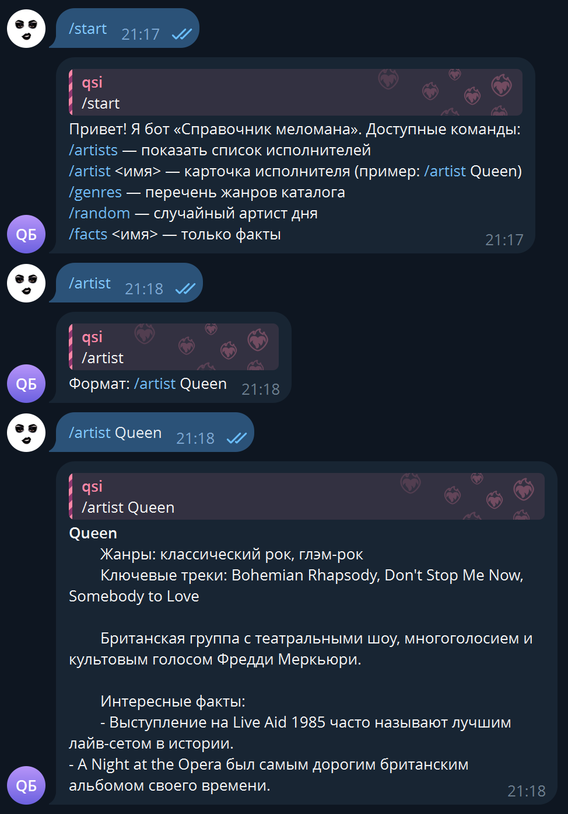

# Практическая работа №22

### Тема: Использование телебота для планировщика задач

### Цель: совершенствование навыков составления программ на основе планировщика задач

#### Задачи:

> Составьте программу-телебот справочник меломана

#### Код программы:

```python
from __future__ import annotations

import os
import random
import textwrap
from pathlib import Path
from typing import Dict, List

import telebot
from telebot.util import extract_arguments


def _load_token() -> str:
    token = os.getenv("TELEGRAM_TOKEN")
    if token:
        return token.strip()

    token_path = Path(__file__).with_name("token.txt")
    if token_path.exists():
        return token_path.read_text(encoding="utf-8").strip()

    raise RuntimeError(
        "Установите TELEGRAM_TOKEN или добавьте token.txt рядом с main.py."
    )


MUSIC_DB: Dict[str, Dict[str, List[str] | str]] = {
    "queen": {
        "name": "Queen",
        "aliases": ["queen", "freddie", "mercury", "квин", "фредди"],
        "genres": ["классический рок", "глэм-рок"],
        "top_tracks": ["Bohemian Rhapsody", "Don't Stop Me Now", "Somebody to Love"],
        "description": (
            "Британская группа с театральными шоу, многоголосием и культовым голосом "
            "Фредди Меркьюри."
        ),
        "facts": [
            "Выступление на Live Aid 1985 часто называют лучшим лайв-сетом в истории.",
            "A Night at the Opera был самым дорогим британским альбомом своего времени.",
        ],
    },
    "pink_floyd": {
        "name": "Pink Floyd",
        "aliases": ["pink", "pink floyd", "пинк флойд"],
        "genres": ["психоделический рок", "прогрессивный рок"],
        "top_tracks": ["Time", "Wish You Were Here", "Comfortably Numb"],
        "description": (
            "Лондонский коллектив, популяризировавший концептуальные альбомы и "
            "иммерсивные световые шоу."
        ),
        "facts": [
            "The Dark Side of the Moon продержался в чарте Billboard 200 более 950 недель.",
            "Тур The Wall включал пенопластовую стену высотой 12 метров, рушащуюся в финале.",
        ],
    },
    "daft_punk": {
        "name": "Daft Punk",
        "aliases": ["daft punk", "daft", "дафт панк"],
        "genres": ["френч-хаус", "электроника"],
        "top_tracks": ["One More Time", "Around the World", "Get Lucky"],
        "description": (
            "Французский дуэт, задавший звучание французского хауса; известен робот-шлемами "
            "и семплерными лайвами."
        ),
        "facts": [
            "Get Lucky принёс дуэту две премии «Грэмми» в 2014 году.",
            "На шоу Alive 2007 музыканты выступали на пирамиде высотой около семи метров.",
        ],
    },
    "nina_simone": {
        "name": "Нина Симон",
        "aliases": ["nina", "simone", "нина", "саймон", "нина симон"],
        "genres": ["джаз", "соул", "блюз"],
        "top_tracks": ["Sinnerman", "Feeling Good", "I Put a Spell on You"],
        "description": (
            "Американская певица и пианистка, сочетавшая джаз, госпел и академическую школу; "
            "активистка движения за гражданские права."
        ),
        "facts": [
            "Получила классическое фортепианное образование и оплачивала уроки, преподавая сама.",
            "Её версия «Feeling Good» стала стандартом и часто звучит в кино и рекламе.",
        ],
    },
    "kino": {
        "name": "Кино (Виктор Цой)",
        "aliases": ["kino", "victor tsoi", "tsoi", "кино", "цой"],
        "genres": ["постпанк", "нью-вейв"],
        "top_tracks": ["Группа крови", "Перемен", "Звезда по имени Солнце"],
        "description": (
            "Легендарная советская рок-группа, ставшая голосом конца 1980-х и символом перемен."
        ),
        "facts": [
            "Посмертный «Чёрный альбом» разошёлся тиражом более миллиона экземпляров.",
            "Стадионные трибьюты поддерживали интерес к песням Цоя многие годы после его гибели.",
        ],
    },
}

BOT = telebot.TeleBot(_load_token(), parse_mode="HTML")


def _format_artist_card(artist: Dict[str, List[str] | str]) -> str:
    top_tracks = ", ".join(artist["top_tracks"]) or "-"
    genres = ", ".join(artist["genres"]) or "-"
    facts = "\n".join(f"- {fact}" for fact in artist["facts"]) or "-"

    return textwrap.dedent(
        f"""
        <b>{artist['name']}</b>
        Жанры: {genres}
        Ключевые треки: {top_tracks}

        {artist['description']}

        Интересные факты:
        {facts}
        """
    ).strip()


def _resolve_artist(query: str) -> Dict[str, List[str] | str] | None:
    normalized = query.strip().lower()
    for artist in MUSIC_DB.values():
        aliases = [artist["name"].lower(), *artist["aliases"]]
        if normalized in aliases:
            return artist
    return None


@BOT.message_handler(commands=["start", "help"])
def send_welcome(message: telebot.types.Message) -> None:
    BOT.reply_to(
        message,
        textwrap.dedent(
            """
            Привет! Я бот «Справочник меломана». Доступные команды:
            /artists — показать список исполнителей
            /artist &lt;имя&gt; — карточка исполнителя (пример: /artist Queen)
            /genres — перечень жанров каталога
            /random — случайный артист дня
            /facts &lt;имя&gt; — только факты
            """
        ).strip(),
    )


@BOT.message_handler(commands=["artists"])
def list_artists(message: telebot.types.Message) -> None:
    names = sorted(artist["name"] for artist in MUSIC_DB.values())
    BOT.reply_to(message, "Исполнители:\n" + "\n".join(f"- {name}" for name in names))


@BOT.message_handler(commands=["genres"])
def list_genres(message: telebot.types.Message) -> None:
    genres = sorted({genre for artist in MUSIC_DB.values() for genre in artist["genres"]})
    BOT.reply_to(message, "Жанры:\n" + ", ".join(genres))


@BOT.message_handler(commands=["artist"])
def artist_detail(message: telebot.types.Message) -> None:
    arguments = extract_arguments(message.text or "")
    if not arguments:
        BOT.reply_to(message, "Формат: /artist Queen")
        return

    artist = _resolve_artist(arguments)
    if not artist:
        BOT.reply_to(message, "Не нашёл такого исполнителя. Используйте /artists.")
        return

    BOT.reply_to(message, _format_artist_card(artist))


@BOT.message_handler(commands=["facts"])
def artist_facts(message: telebot.types.Message) -> None:
    arguments = extract_arguments(message.text or "")
    if not arguments:
        BOT.reply_to(message, "Пример: /facts Daft Punk")
        return

    artist = _resolve_artist(arguments)
    if not artist:
        BOT.reply_to(message, "Имя не распознано. Посмотрите каталог через /artists.")
        return

    text = "\n".join(f"- {fact}" for fact in artist["facts"])
    BOT.reply_to(message, f"Факты про {artist['name']}:\n{text}")


@BOT.message_handler(commands=["random"])
def random_artist(message: telebot.types.Message) -> None:
    artist = random.choice(list(MUSIC_DB.values()))
    BOT.reply_to(message, "Случайный выбор:\n" + _format_artist_card(artist))


@BOT.message_handler(func=lambda msg: True)
def fallback(message: telebot.types.Message) -> None:
    BOT.reply_to(message, "Я понимаю только команды. Напишите /help для подсказки.")


if __name__ == "__main__":
    BOT.infinity_polling(timeout=60, long_polling_timeout=60)

```

#### Результат работы программы:



#### Вывод по проделанной работе:

> Нормально
