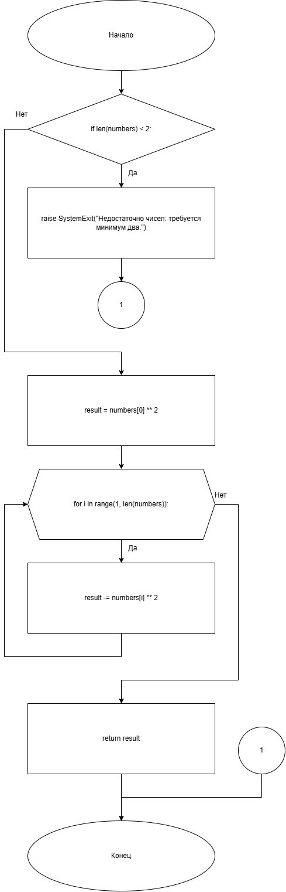
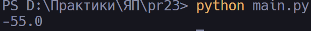

# Практическая работа №23

### Тема: Ввод и вывод c помощью потоков ввода -вывода

### Цель: приобрести навыки составления программ с использованием файлового ввода-вывода 

#### Задачи:

> Напишите программу, которая вычисляет разность квадратов чисел, находящихся в файле с:\number3.txt

#### Системный анализ:

> Входные данные: `List[float] numbers`  
> Промежуточные данные: `---`  
> Выходные данные: `float first` `float second`  

#### Контрольный пример:

- Ввожу

  > 10 2 3 7 8 2 5 

- Получаю

  > -55.0

#### Блок схема:



#### Код программы:

```python
from pathlib import Path
from typing import List

INPUT_FILE = Path(r"numbers.txt")


def load_numbers(path: Path) -> List[float]:
    try:
        raw_content = path.read_text(encoding="utf-8")
    except FileNotFoundError as exc:
        raise SystemExit(f"Не удалось открыть файл {path!s}: {exc}") from exc

    tokens = raw_content.split()
    if not tokens:
        raise SystemExit("Файл не содержит данных для обработки.")

    numbers: List[float] = []
    for token in tokens:
        normalized = token.replace(",", ".")
        try:
            numbers.append(float(normalized))
        except ValueError as exc:
            raise SystemExit(f"Не удалось преобразовать '{token}' в число.") from exc
    return numbers


def difference_of_squares(numbers: List[float]) -> float:
    if len(numbers) < 2:
        raise SystemExit("Недостаточно чисел: требуется минимум два.")
    
    result = numbers[0] ** 2
    for i in range(1, len(numbers)):
        result -= numbers[i] ** 2
        
    return result


def main() -> None:
    numbers = load_numbers(INPUT_FILE)
    result = difference_of_squares(numbers)
    print(result)


if __name__ == "__main__":
    main()

```

#### Результат работы программы:



#### Вывод по проделанной работе:

> Работает