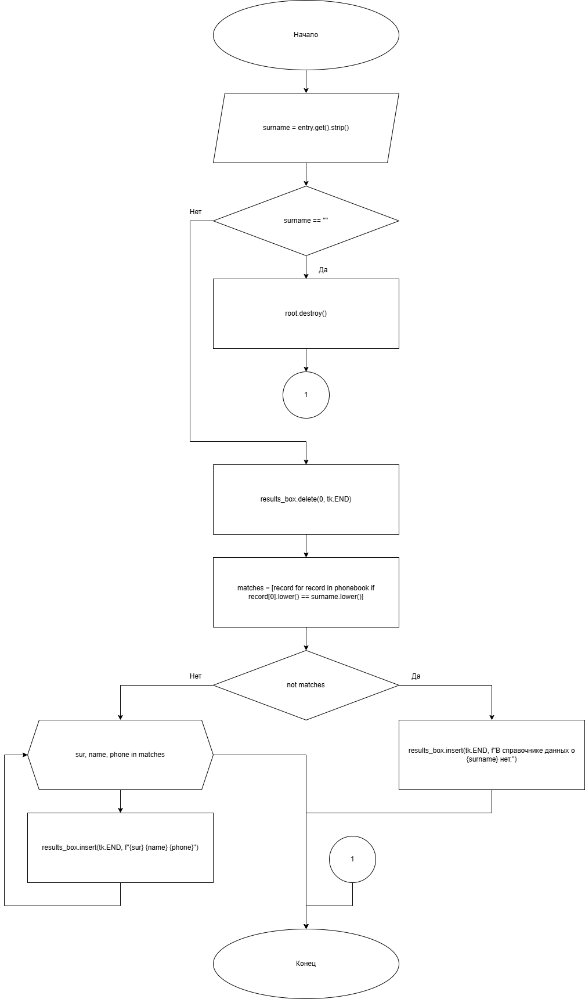
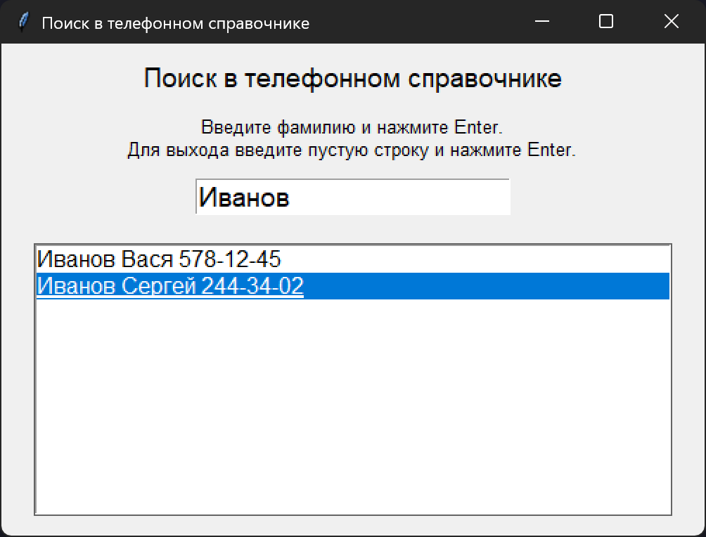

# Практическая работа 24№

### Тема: Сохранение и восстановление состояния объекта в файле

### Цель: Приобрести навыки составления программ с использованием файлов

#### Задачи:

> Напишите программу, которая позволяет найти в телефонном справочнике (с:\phone.txt) нужные сведения Программа должна запрашивать фамилию человека и выводить его телефон. Если в справочнике есть люди с одинаковыми фамилиями, то программа должна вывести список всех этих людей.

#### Системный анализ:

> Входные данные: `string surname`  
Промежуточные данные: `array matches` `string sur` `string name` `phone`  
> Выходные данные: `string results_box`  

#### Контрольный пример:

- Ввожу

  > Иванов

- Получаю

  > Иванов  Вася  578-12-45   
  > Иванов  Сергей  244-34-02  

#### Блок схема:



#### Код программы:

```python
import tkinter as tk
from tkinter import messagebox

PHONE_FILE = r"phone.txt"


def load_phonebook():
    phonebook = []
    try:
        with open(PHONE_FILE, "r", encoding="utf-8") as f:
            for line in f:
                parts = line.strip().split()
                if len(parts) >= 3:
                    surname = parts[0]
                    name = parts[1]
                    phone = parts[2]
                    phonebook.append((surname, name, phone))
    except FileNotFoundError:
        messagebox.showerror("Ошибка", f"Файл {PHONE_FILE} не найден")
    return phonebook


def search():
    surname = entry.get().strip()
    if surname == "":
        root.destroy()
        return

    results_box.delete(0, tk.END)

    matches = [record for record in phonebook if record[0].lower() == surname.lower()]

    if not matches:
        results_box.insert(tk.END, f"В справочнике данных о {surname} нет.")
    else:
        for sur, name, phone in matches:
            results_box.insert(tk.END, f"{sur} {name} {phone}")


root = tk.Tk()
root.title("Поиск в телефонном справочнике")
root.geometry("500x350")

tk.Label(root, text="Поиск в телефонном справочнике", font=("Arial", 14)).pack(pady=10)
tk.Label(root, text="Введите фамилию и нажмите Enter.\nДля выхода введите пустую строку и нажмите Enter.",
         font=("Arial", 10)).pack()

entry = tk.Entry(root, font=("Arial", 14))
entry.pack(pady=10)
entry.bind("<Return>", lambda event: search())

results_box = tk.Listbox(root, width=50, height=10, font=("Arial", 12))
results_box.pack(pady=10)

phonebook = load_phonebook()

root.mainloop()

```

#### Результат работы программы:



#### Вывод по проделанной работе:

> 😺
