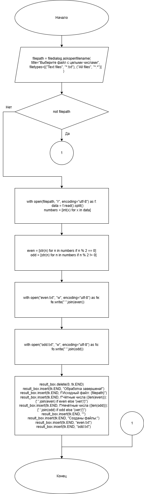
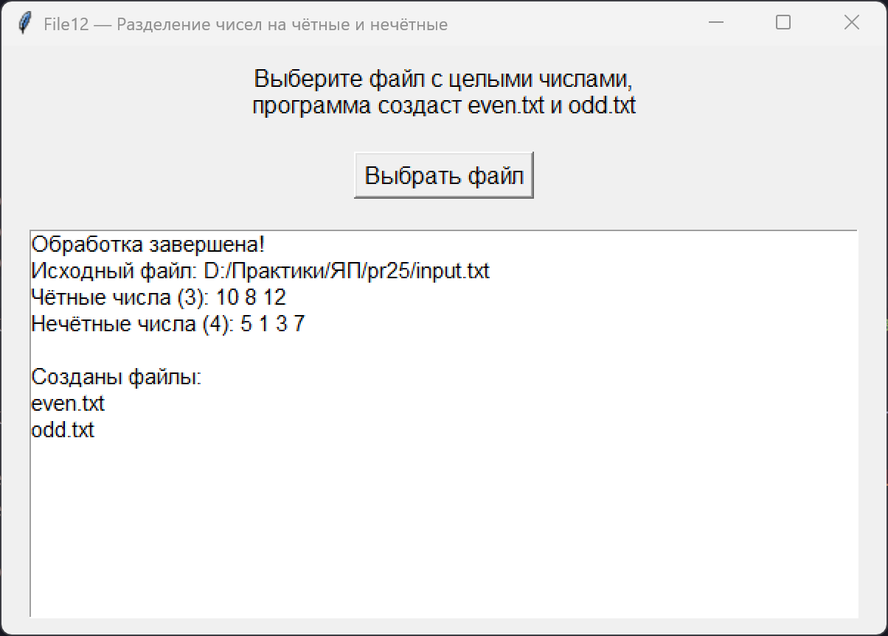

# Практическая работа №25

### Тема: Составление программ с использованием работы с файлами на диске 

### Цель: Приобрести навыки составления программ с использованием файловых операций

#### Задачи:

> File12 — Разделение чисел на чётные и нечётные

#### Системный анализ:  
  
> Входные данные: `string filepath` `array data` `array numbers`  
> Промежуточные данные: `array even` `array odd` `string fe` `string fo`   
> Выходные данные: `ListBox result_box`   

#### Контрольный пример:

- Ввожу

  > 10 5 8 1 3 12 7

- Получаю

  > Четные: 10 8 12  
  > Нечетные: 5 1 3 7 


#### Блок схема:



#### Код программы:

```python
import tkinter as tk
from tkinter import messagebox, filedialog

def process_file():
    filepath = filedialog.askopenfilename(
        title="Выберите файл с целыми числами",
        filetypes=[("Text files", "*.txt"), ("All files", "*.*")]
    )
    if not filepath:
        return

    try:
        with open(filepath, "r", encoding="utf-8") as f:
            data = f.read().split()
            numbers = [int(x) for x in data]
    except Exception as e:
        messagebox.showerror("Ошибка", f"Не удалось прочитать файл:\n{e}")
        return

    even = [str(n) for n in numbers if n % 2 == 0]
    odd = [str(n) for n in numbers if n % 2 != 0]

    try:
        with open("even.txt", "w", encoding="utf-8") as fe:
            fe.write(" ".join(even))

        with open("odd.txt", "w", encoding="utf-8") as fo:
            fo.write(" ".join(odd))
    except Exception as e:
        messagebox.showerror("Ошибка", f"Не удалось создать файлы:\n{e}")
        return

    result_box.delete(0, tk.END)
    result_box.insert(tk.END, "Обработка завершена!")
    result_box.insert(tk.END, f"Исходный файл: {filepath}")
    result_box.insert(tk.END, f"Чётные числа ({len(even)}): {' '.join(even) if even else '(нет)'}")
    result_box.insert(tk.END, f"Нечётные числа ({len(odd)}): {' '.join(odd) if odd else '(нет)'}")
    result_box.insert(tk.END, "")
    result_box.insert(tk.END, "Созданы файлы:")
    result_box.insert(tk.END, "even.txt")
    result_box.insert(tk.END, "odd.txt")


root = tk.Tk()
root.title("File12 — Разделение чисел на чётные и нечётные")
root.geometry("600x400")

tk.Label(root, text="Выберите файл с целыми числами,\nпрограмма создаст even.txt и odd.txt",
         font=("Arial", 12)).pack(pady=10)

tk.Button(root, text="Выбрать файл", font=("Arial", 12), command=process_file).pack(pady=10)

result_box = tk.Listbox(root, width=70, height=15, font=("Arial", 11))
result_box.pack(pady=10)

root.mainloop()

```

#### Результат работы программы:



#### Вывод по проделанной работе:

> 😺