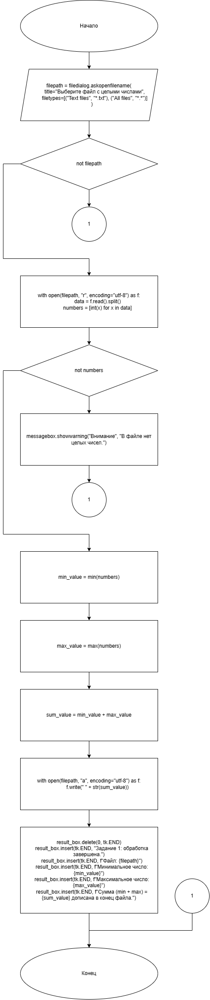
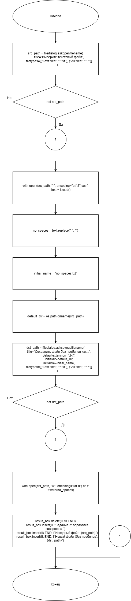
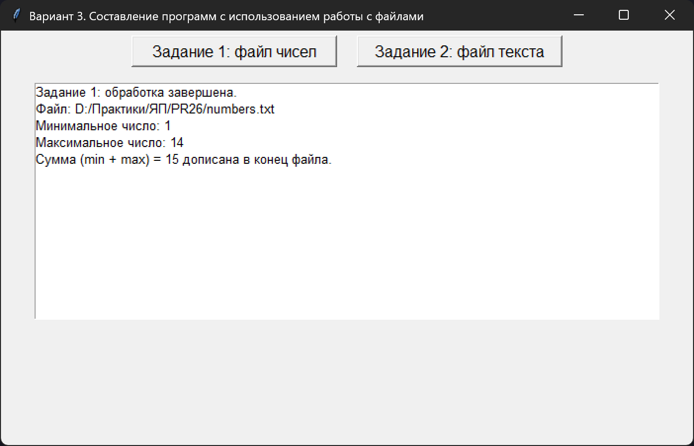
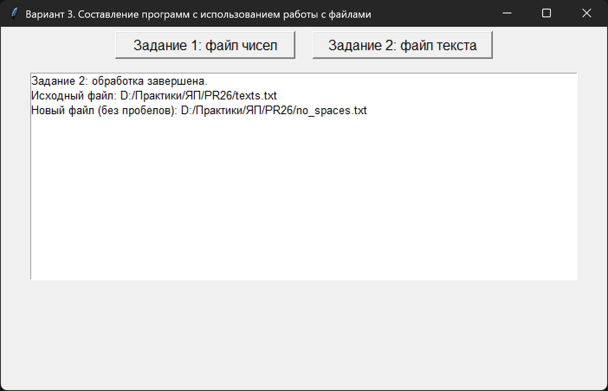

# Практическая работа №26

### Тема: Составление программ с использованием работы с записью файлов

### Цель: приобрести навыки составления  программ  с использованием массивов и команд для работы с файлами

#### Задачи:

> Вариант 3  
> 1. Программа открывает текстовый файл, который содержит некоторое количество целых чисел. Найти сумму минимального и максимального из чисел, записанных в файле, и дописать эту сумму в конец имеющегося файла. 
> 2. Дан файл, содержащий произвольный текст. Удалить все пробелы из файла. Результат записать в новый файл. 

#### Системный анализ:  

### Задание 1
  
> Входные данные: `string filepath`  
> Промежуточные данные: `int min_value` `int max_value` `int sum_value`  
> Выходные данные: `string result_box`  

### Задание 2
  
> Входные данные: `string src_path`   
> Промежуточные данные: `string text` `string no_spaces` `string initial_name` `string default_dir` `string dst_path`  
> Выходные данные: `string result_box`    

#### Контрольный пример:

### Задание 1

- Ввожу

  > 10 5 8 1 3 12 7 13 14

- Получаю

  > 10 5 8 1 3 12 7 13 14 15

### Задание 2

- Ввожу

  > Съешь ещё этих мягких французских булок, да выпей же чаю

- Получаю

  > Съешьещёэтихмягкихфранцузскихбулок,давыпейжечаю


#### Блок схема:

### Задание 1



### Задание 2



#### Код программы:

```python
import tkinter as tk
from tkinter import filedialog, messagebox
import os


def task1_process_numbers():
    filepath = filedialog.askopenfilename(
        title="Выберите файл с целыми числами",
        filetypes=[("Text files", "*.txt"), ("All files", "*.*")]
    )
    if not filepath:
        return

    try:
        with open(filepath, "r", encoding="utf-8") as f:
            data = f.read().split()
            numbers = [int(x) for x in data]
    except Exception as e:
        messagebox.showerror("Ошибка", f"Не удалось прочитать файл как числа:\n{e}")
        return

    if not numbers:
        messagebox.showwarning("Внимание", "В файле нет целых чисел.")
        return

    min_value = min(numbers)
    max_value = max(numbers)
    sum_value = min_value + max_value

    try:
        with open(filepath, "a", encoding="utf-8") as f:
            f.write(" " + str(sum_value))
    except Exception as e:
        messagebox.showerror("Ошибка", f"Не удалось дописать в файл:\n{e}")
        return

    result_box.delete(0, tk.END)
    result_box.insert(tk.END, "Задание 1: обработка завершена.")
    result_box.insert(tk.END, f"Файл: {filepath}")
    result_box.insert(tk.END, f"Минимальное число: {min_value}")
    result_box.insert(tk.END, f"Максимальное число: {max_value}")
    result_box.insert(tk.END, f"Сумма (min + max) = {sum_value} дописана в конец файла.")


def task2_remove_spaces():
    src_path = filedialog.askopenfilename(
        title="Выберите текстовый файл",
        filetypes=[("Text files", "*.txt"), ("All files", "*.*")]
    )
    if not src_path:
        return

    try:
        with open(src_path, "r", encoding="utf-8") as f:
            text = f.read()
    except Exception as e:
        messagebox.showerror("Ошибка", f"Не удалось прочитать файл:\n{e}")
        return

    no_spaces = text.replace(" ", "")

    initial_name = "no_spaces.txt"
    default_dir = os.path.dirname(src_path)

    dst_path = filedialog.asksaveasfilename(
        title="Сохранить файл без пробелов как...",
        defaultextension=".txt",
        initialdir=default_dir,
        initialfile=initial_name,
        filetypes=[("Text files", "*.txt"), ("All files", "*.*")]
    )
    if not dst_path:
        return

    try:
        with open(dst_path, "w", encoding="utf-8") as f:
            f.write(no_spaces)
    except Exception as e:
        messagebox.showerror("Ошибка", f"Не удалось записать файл:\n{e}")
        return

    result_box.delete(0, tk.END)
    result_box.insert(0, "Задание 2: обработка завершена.")
    result_box.insert(tk.END, f"Исходный файл: {src_path}")
    result_box.insert(tk.END, f"Новый файл (без пробелов): {dst_path}")


root = tk.Tk()
root.title("Вариант 3. Составление программ с использованием работы с файлами")
root.geometry("700x420")


btn_frame = tk.Frame(root)
btn_frame.pack(pady=5)

btn1 = tk.Button(btn_frame, text="Задание 1: файл чисел", font=("Arial", 12),
                 width=22, command=task1_process_numbers)
btn1.grid(row=0, column=0, padx=10)

btn2 = tk.Button(btn_frame, text="Задание 2: файл текста", font=("Arial", 12),
                 width=22, command=task2_remove_spaces)
btn2.grid(row=0, column=1, padx=10)

result_box = tk.Listbox(root, width=90, height=14, font=("Arial", 10))
result_box.pack(pady=10)

root.mainloop()

```

#### Результат работы программы:

### Задание 1



### Задание 2



#### Вывод по проделанной работе:

> 😺