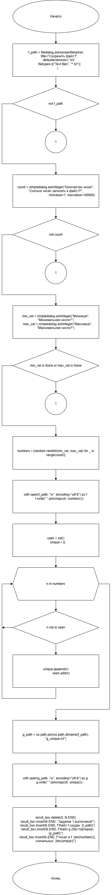
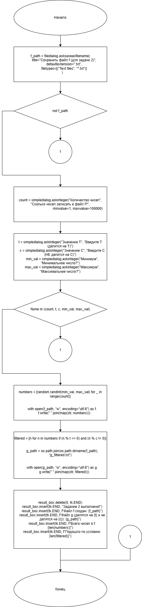
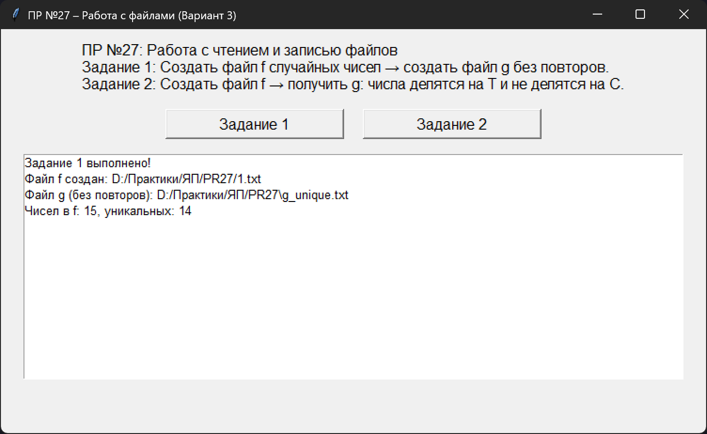
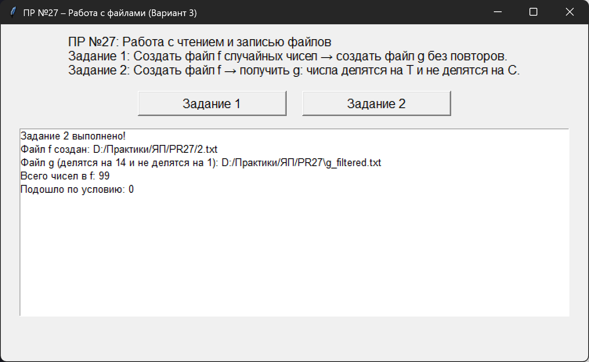

# Практическая работа № 27

### Тема: Составление программ с использованием чтения и записи файлов

### Цель: Приобрести навыки составления  программ  с использованием массивов и команд для работы с файлами 

#### Задачи:

> Вариант 13. Заполнить файл f целыми числами, полученными с помощью генератора случайных чисел. из файла f получить файл g, исключив повторные вхождения чисел. порядок следования чисел сохранить. 

> Вариант 3. Заполнить файл последовательного доступа f целыми числами, полученными с помощью генератора случайных чисел. получить в файле g все компоненты файла f, которые делятся на Т и не делятся на С.

#### Системный анализ:  
  
### Вариант 13

> Входные данные: `string f_path`  
> Промежуточные данные: `int count` `int min_val` `max_val` `array numbers` `set seen` `array unique` `g_path`  
> Выходные данные: `result_box`  

### Вариант 3

> Входные данные: `string f_path`  
> Промежуточные данные: `int count` `int c` `int t` `int min_val` `int max_val` `array numbers` `array filtered` `string sg_path`
> Выходные данные: `string result_box`

#### Контрольный пример:

### Вариант 13

- Ввожу

  > 37 11 41 38 14 16 33 22 23 24 36 27 43 32 23

- Получаю

  > 37 11 41 38 14 16 33 22 23 24 36 27 43 32

### Вариант 3

- Ввожу

  > 67 174 187 113 65 10 92 172 102 128 32 91 72 91 41 151 161 89 96 183 154 11 146 135 44 193 79 103 20 13 144 145 133 138 160 42 86 96 108 166 56 100 180 35 67 127 37 154 78 68 20 70 23 32 186 193 125 166 23 21 182 135 65 111 83 53 55 86 34 179 60 67 187 106 144 93 17 28 24 127 194 26 164 106 162 174 181

- Получаю

  > 91 91 161 133 35 21


#### Блок схема:

### Вариант 13



### Вариант 3



#### Код программы:

```python
import tkinter as tk
from tkinter import messagebox, filedialog, simpledialog
import random
import os


def task1():
    f_path = filedialog.asksaveasfilename(
        title="Сохранить файл f",
        defaultextension=".txt",
        filetypes=[("Text files", "*.txt")]
    )
    if not f_path:
        return

    count = simpledialog.askinteger("Количество чисел", "Сколько чисел записать в файл f?",
                                    minvalue=1, maxvalue=100000)
    if not count:
        return

    min_val = simpledialog.askinteger("Минимум", "Минимальное число?")
    max_val = simpledialog.askinteger("Максимум", "Максимальное число?")
    if min_val is None or max_val is None:
        return

    numbers = [random.randint(min_val, max_val) for _ in range(count)]

    with open(f_path, "w", encoding="utf-8") as f:
        f.write(" ".join(map(str, numbers)))

    seen = set()
    unique = []
    for n in numbers:
        if n not in seen:
            unique.append(n)
            seen.add(n)

    g_path = os.path.join(os.path.dirname(f_path), "g_unique.txt")

    with open(g_path, "w", encoding="utf-8") as g:
        g.write(" ".join(map(str, unique)))

    result_box.delete(0, tk.END)
    result_box.insert(tk.END, "Задание 1 выполнено!")
    result_box.insert(tk.END, f"Файл f создан: {f_path}")
    result_box.insert(tk.END, f"Файл g (без повторов): {g_path}")
    result_box.insert(tk.END, f"Чисел в f: {len(numbers)}, уникальных: {len(unique)}")


def task2():
    f_path = filedialog.asksaveasfilename(
        title="Сохранить файл f (для задачи 2)",
        defaultextension=".txt",
        filetypes=[("Text files", "*.txt")]
    )
    if not f_path:
        return

    count = simpledialog.askinteger("Количество чисел", "Сколько чисел записать в файл f?",
                                    minvalue=1, maxvalue=100000)
    t = simpledialog.askinteger("Значение T", "Введите T (делится на T)")
    c = simpledialog.askinteger("Значение C", "Введите C (НЕ делится на C)")
    min_val = simpledialog.askinteger("Минимум", "Минимальное число?")
    max_val = simpledialog.askinteger("Максимум", "Максимальное число?")

    if None in (count, t, c, min_val, max_val):
        return

    numbers = [random.randint(min_val, max_val) for _ in range(count)]

    with open(f_path, "w", encoding="utf-8") as f:
        f.write(" ".join(map(str, numbers)))

    filtered = [n for n in numbers if (n % t == 0) and (n % c != 0)]

    g_path = os.path.join(os.path.dirname(f_path), "g_filtered.txt")

    with open(g_path, "w", encoding="utf-8") as g:
        g.write(" ".join(map(str, filtered)))

    result_box.delete(0, tk.END)
    result_box.insert(tk.END, "Задание 2 выполнено!")
    result_box.insert(tk.END, f"Файл f создан: {f_path}")
    result_box.insert(tk.END, f"Файл g (делятся на {t} и не делятся на {c}): {g_path}")
    result_box.insert(tk.END, f"Всего чисел в f: {len(numbers)}")
    result_box.insert(tk.END, f"Подошло по условию: {len(filtered)}")


root = tk.Tk()
root.title("ПР №27 – Работа с файлами (Вариант 3)")
root.geometry("750x430")

title = tk.Label(
    root,
    text=("ПР №27: Работа с чтением и записью файлов\n"
          "Задание 1: Создать файл f случайных чисел → создать файл g без повторов.\n"
          "Задание 2: Создать файл f → получить g: числа делятся на T и не делятся на C."),
    font=("Arial", 12),
    justify="left"
)
title.pack(pady=10)

btn_frame = tk.Frame(root)
btn_frame.pack(pady=5)

btn1 = tk.Button(btn_frame, text="Задание 1", font=("Arial", 12), width=20, command=task1)
btn1.grid(row=0, column=0, padx=10)

btn2 = tk.Button(btn_frame, text="Задание 2", font=("Arial", 12), width=20, command=task2)
btn2.grid(row=0, column=1, padx=10)

result_box = tk.Listbox(root, width=100, height=14, font=("Arial", 10))
result_box.pack(pady=10)

root.mainloop()

```

#### Результат работы программы:

### Вариант 13



### Вариант 3



#### Вывод по проделанной работе:

> 😶‍🌫️